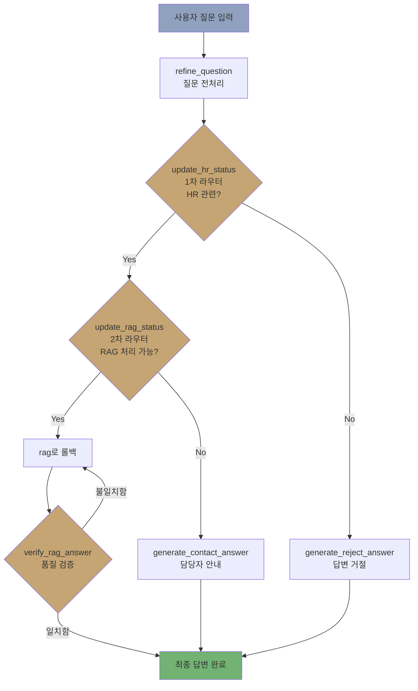

# 가이다 HR 챗봇 🤖

**RAG 기반 사내 HR 질문 응답 시스템**

가상의 회사 '가이다 플레이 스튜디오(Gaida Play Studio, GPS)'를 위한 AI 기반 HR 챗봇으로, RAG(Retrieval-Augmented Generation), Reranker, 검증 루프 기술을 사용하여 사내 정책에 대한 정확한 정보를 제공합니다.

> 🔗 **Live Demo**: [https://frontend-iqeh.onrender.com](https://frontend-iqeh.onrender.com)

---

## 참여인원, 역할
4인, 1차 라우터, 거절 노드, 전처리 노드, 배포

## 문제해결

- RAG 파이프라인 고도화: 검색, 리랭킹, 답변 정확성 검증 루프 구현을 통한 답변 에러 확률 축소 2% → 0%
- 응답 속도 8% 개선: 프롬프트 최적화 및 경량 모델(GPT-4o-mini) 도입을 통해 First Token Latency(P50)를 0.64s → 0.59s로 단축
- 프롬프트 내 지시 사항의 우선순위를 재정립하여 충돌을 방지, 보안 위배 질문이 RAG로 넘어가지 않도록 전처리 로직 강화하여 답변 안정성, 평균 답변 시작 시간을 0.6~1.6s 확보
- 코드 복잡도 해소: 복잡한 파싱 로직을 Structured Output(구조화된 출력) 방식으로 리팩토링하여 오버엔지니어링 문제를 해결하고 유지보수성 향상

## 성과

- LangGraph 기반 순환형 아키텍처 구축 경험(조건부 분기 및 예외 처리 로직 설계)
- 리랭킹과 답변 검증 루프가 적용된 RAG 시스템을 구축하여, 환각을 최소화하고 답변 정확도 향상 기술 경험

---

## 🎯 핵심 기능

| 기능 | 설명 |
|---|---|
| **RAG 기반 답변 생성** | Pinecone 벡터 DB를 활용한 의미론적 문서 검색 및 답변 생성 |
| **자동 질문 분류** | 1차(HR 여부) → 2차(RAG 처리 가능 여부) 자동 분기 |
| **AI 기반 답변 검증** | 답변 품질 검증 및 재생성 루프 |
| **담당 부서 안내** | RAG 처리 불가 질문에 대한 담당 부서/이메일/Slack 안내 |
| **질문 전처리** | 모호한 질문을 LLM이 처리하기 쉬운 형태로 자동 정제 |

---

## 🗂 프로젝트 구조

```
📦 HR_chatbot_project/
├── 📂 backend/                 # FastAPI + LangGraph (API 키 보유)
│   ├── 📄 main.py              # FastAPI 엔트리포인트
│   ├── 📄 graph.py             # LangGraph 워크플로우 정의
│   ├── 📄 nodes.py             # 노드 구현 (검색, 생성, 검증)
│   ├── 📄 router.py            # 질문 분류 라우팅 로직
│   ├── 📄 state.py             # LangGraph State 정의
│   ├── 📄 db.py                # Pinecone 벡터 DB 연동
│   ├── 📄 llm.py               # LLM 팩토리 함수
│   ├── 📄 config.py            # 환경 변수 관리 (pydantic-settings)
│   ├── 📄 Dockerfile           # Backend Docker 이미지
│   └── 📄 requirements.txt     # Backend 의존성
├── 📂 frontend/                # Streamlit UI (API 키 미보유)
│   ├── 📄 app.py               # 챗봇 UI
│   ├── 📄 Dockerfile           # Frontend Docker 이미지
│   └── 📄 requirements.txt     # Frontend 의존성
├── 📄 docker-compose.yml       # Docker Compose 설정
├── 📄 render.yaml              # Render Blueprint 배포 설정
├── 📄 .env.example             # 환경 변수 템플릿
└── 📄 README.md
```

---

## 🛠 기술 스택

| 영역 | 기술 |
|---|---|
| **Backend** | FastAPI, LangGraph, Python 3.12 |
| **Frontend** | Streamlit |
| **LLM** | GPT-4.1 (생성), GPT-4.1-nano (라우터) |
| **Vector DB** | Pinecone + OpenAI text-embedding-3-small |
| **Infra** | Docker, Render (Free Plan) |

---

## 🔄 LangGraph 워크플로우



---

## 🚀 실행 방법

### 환경 변수 설정
프로젝트 루트에 `.env.example` 파일에 발급받은 API_KEY를 넣습니다.
```bash
OPENAI_API_KEY=your_openai_api_key
PINECONE_API_KEY=your_pinecone_api_key
PINECONE_INDEX=gaida-hr-rules
```

### 로컬 실행 (Docker Compose)
```bash
docker-compose up --build
```
- Backend API: `http://localhost:8000`
- Frontend UI: `http://localhost:8501`

---

## ☁️ Render 배포

Backend와 Frontend를 **각각 별도 Web Service**로 배포합니다.

### 서비스 구성

| 서비스 | URL | 역할 |
|---|---|---|
| Backend | `https://hr-chatbot-project.onrender.com` | FastAPI + RAG API |
| Frontend | `https://frontend-iqeh.onrender.com` | Streamlit 챗봇 UI |

### Step 1: Backend 서비스

| 설정 | 값 |
|---|---|
| Runtime | Docker |
| Dockerfile Path | `./backend/Dockerfile` |
| Docker Build Context | `.` |
| Health Check Path | `/health` |

**Environment Variables:**
| Key | Value |
|---|---|
| `OPENAI_API_KEY` | `sk-...` |
| `PINECONE_API_KEY` | `pcsk_...` |
| `PINECONE_INDEX` | `gaida-hr-rules` |
| `ALLOWED_ORIGINS` | `https://frontend-iqeh.onrender.com` |

### Step 2: Frontend 서비스

| 설정 | 값 |
|---|---|
| Runtime | Docker |
| Dockerfile Path | `./frontend/Dockerfile` |
| Docker Build Context | `.` |

**Environment Variables:**
| Key | Value |
|---|---|
| `BACKEND_URL` | `https://hr-chatbot-project.onrender.com` |

### API 엔드포인트

| Method | Path | 설명 |
|---|---|---|
| `GET` | `/` | 서버 상태 확인 |
| `GET` | `/health` | Health Check |
| `GET` | `/docs` | Swagger API 문서 |
| `POST` | `/chat` | 챗봇 질의 (`{"query": "질문"}`) |

---

## 📝 사용 예시

**✅ RAG 답변**
```
👤: "입사 4개월차에는 연차 얼마나 있나요?"
🤖: "입사 4개월 차라면 1년 미만 근속자에 해당하므로, 매달 1개월 만근 시 1개의 월차가 부여됩니다..."
```

**📞 담당자 안내**
```
👤: "급여 계산에 오류가 있는 것 같은데 어디에 문의해야 하나요?"
🤖: "해당 문의사항은 인사팀으로 문의하시면 됩니다. 📧 hr@gaida.play.com 💬 #ask-hr"
```

**❌ 질문 거절**
```
👤: "오늘 날씨가 어때요?"
🤖: "입력하신 질문은 HR 관련 문의가 아닙니다. HR 관련 질문만 가능합니다."
```

---

## 👥 개발 과정

| 내용 |
|---|---|
| 요구사항 분석 및 아키텍처 설계 |
| 가상 회사 데이터 제작 및 벡터DB 구축 |
| LangGraph 노드 개발 및 라우팅 로직 구현 |
| 통합 테스트 및 LangGraph Studio 최적화 |
| MVP 완성 및 시연 준비 |
| 배포 |

### 주요 도전과제

| 과제 | 문제 | 해결 |
|---|---|---|
| HR 데이터 확보 | 기밀성·저작권으로 실제 데이터 사용 불가 | 가상 회사 모델링으로 데이터셋 자체 제작 |
| 임베딩 모델 메모리 | 한국어 특화 모델 메모리 부족 | OpenAI embeddings-3-small API 활용 |
| 답변 품질 일관성 | RAG 답변 정확성 보장 필요 | 문서 기반 검증 + 재생성 루프 구현 |
| 코드 복잡도 | 오버엔지니어링 발생 | `with_structured_output`으로 단순화 |

---