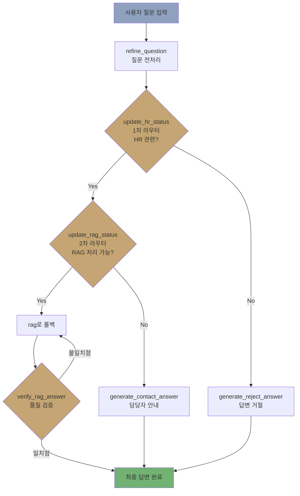

# 가이다 HR 챗봇 🤖

**RAG 기반 사내 HR 질문 응답 시스템**

가상의 회사 '가이다 플레이 스튜디오(Gaida Play Studio, GPS)'를 위한 AI 기반 HR 챗봇으로, RAG(Retrieval-Augmented Generation), Reranker, 검증 루프 기술을 사용하여 사내 정책에 대한 정확한 정보를 제공합니다.

---

## 참여인원, 역할  
4인, 1차 라우터, 거절 노드, 전처리 노드 프롬프팅 개발

## 문제해결

- RAG 파이프라인 고도화: 검색, 리랭킹, 답변 정확성 검증 루프 구현을 통한 답변 에러 확률 축소 2% → 0%

- 응답 속도 8% 개선: 프롬프트 최적화 및 경량 모델(GPT-4o-mini) 도입을 통해 First Token Latency(P50)를 0.64s → 0.59s로 단축

- 프롬프트 내 지시 사항의 우선순위를 재정립하여 충돌을 방지, 보안 위배 질문이 RAG로 넘어가지 않도록 전처리 로직 강화하여 답변 안정성, 평균 답변 시작 시간을 0.6~1.6s 확보

- 코드 복잡도 해소: 복잡한 파싱 로직을 Structured Output(구조화된 출력) 방식으로 리팩토링하여 오버엔지니어링 문제를 해결하고 유지보수성 향상

## 성과

- LangGraph 기반 순환형 아키텍처 구축 경험(조건부 분기 및 예외 처리 로직 설계)

- 리랭킹과 답변 검증 루프가 적용된 RAG 시스템을 구축하여, 환각을 최소화하고 답변 정확도 향상 기술 경험

## 🎯 핵심 기능

### 1. **RAG 기반 정확한 답변 생성**

- Pinecone 벡터 DB를 활용한 의미론적 문서 검색
- 검색된 문서 기반의 신뢰성 있는 답변 생성

### 2. **자동 질문 분류**

- 1차: HR 관련 질문 여부 자동 판단
- 2차: RAG 처리 가능 여부 분석
- 비관련 질문에 대한 적절한 거절 응답

### 3. **AI 기반 답변 검증**

- 답변 품질 검증 및 재생성 루프

### 4. **담당 부서 안내 서비스**

- RAG로 처리 불가능한 질문에 대한 담당 부서 연결
- 이메일 및 Slack 채널 정보 제공

### 5. **사용자 친화적 질문 전처리**

- 사용자 질문을 LLM이 이해하기 쉬운 형태로 자동 정제
- 모호한 질문에 대한 명확화

---

## 📊 수집한 데이터 설명

### 데이터 생성 배경

- **문제점**: 실제 HR 문서는 외부 유출 금지 + 저작권 문제
- **해결방안**: 가상의 회사 '가이다 플레이 스튜디오' 모델링을 통한 데이터셋 자체 제작

### 현재 데이터

| 파일명 | 내용 | 규모 |
| --- | --- | --- |
| `04_복지정책_v1.0.md` | 사내 복지정책 전반 | 2,171 토큰 / 3,701 문자 |

**포함 내용:**

- 휴가 제도 (연차, 병가, 가족돌봄휴가)
- 복지포인트 및 교육비 지원 제도
- 업무 장비 지원 제도
- 건강검진 지원 제도
- 스낵바 및 동아리 활동 지원 제도
- 여성 직원을 위한 임신육아 제도

### 향후 확장 계획

- 근무정책, 장비보안 규정, 기타(경비 처리 절차 등) 등 추가 문서 제작 예정
- 더 다양한 HR 영역 커버를 위한 데이터셋 확장

---

## 🔄 노드-엣지 구조 및 그래프



### 📋 각 노드 상세 설명

### **1. refine_question (전처리 노드)**

- **기능**: 사용자 질문을 LLM이 이해하기 쉬운 명확한 형태로 정제
- **입력**: `user_question`
- **출력**: `refine_question`

### **2. update_hr_status (1차 상태 업데이트)**

- **기능**: HR 관련 질문 여부 판단 결과를 State에 저장
- **LLM**: GPT-4.1-nano (빠른 분류를 위한 경량 모델)
- **출력**: `is_hr_question` (True/False)

### **3. route_after_hr (1차 라우터)**

- **기능**: `is_hr_question` 값에 따른 경로 분기
- **분기**: HR 관련 → 2차 라우터 / 비관련 → 거절

### **4. update_rag_status (2차 상태 업데이트)**

- **기능**: RAG 처리 가능 여부 판단 결과를 State에 저장
- **LLM**: GPT-4.1-nano (빠른 분류를 위한 경량 모델)
- **출력**: `is_rag_suitable` (True/False)

### **5. route_after_rag (2차 라우터)**

- **기능**: `is_rag_suitable` 값에 따른 경로 분기
- **분기**: RAG 가능 → 답변 생성 / 불가능 → 담당자 안내

### **6. generate_rag_answer (RAG 답변 생성)**

- **기능**: 벡터 검색 → 관련 문서 추출 → 답변 생성
- **프로세스**:
    1. Pinecone에서 Top-K 유사 문서 검색
    2. GPT-4.1을 통한 답변 생성
- **출력**: `retrieved_docs`, `final_answer`

### **7. verify_rag_answer (품질 검증)**

- **기능**: 생성된 답변이 검색 문서에만 근거했는지 검증
- **검증 기준**: 문서 내용과의 완전한 일치 여부
- **출력**: `verification` ("일치함"/"불일치함")
- **재처리**: 불일치시 `rag_answer`로 루프백

### **8. generate_contact_answer (담당자 안내)**

- **기능**: RAG 처리 불가 질문에 대한 담당 부서 정보 제공
- **출력**: 부서별 이메일, Slack 채널 정보

### **9. generate_reject_answer (질문 거절)**

- **기능**: HR 비관련 질문에 대한 정중한 거절 메시지
- **출력**: "입력하신 질문은 HR 관련 문의가 아닙니다. HR 관련 질문만 가능합니다."

---

## 🛠 기술 스택

### **Core Framework**

- **LangGraph**: 복잡한 AI 워크플로우 구성
- **LangGraph Studio**: 개발 및 시연 환경

### **Language Models**

- **GPT-4.1**: 본문 생성 및 분석 (주력 모델)
- **GPT-4.1-nano**: 라우터 분기 판단 (빠른 분류용)

### **Vector Database & Embeddings**

- **Pinecone**: 벡터 데이터베이스 (무료 티어 활용)
- **OpenAI text-embedding-3-small**: 임베딩 모델
    - 한국어 특화 모델 대비 메모리 효율성으로 선택
    - 외부 API 방식으로 인프라 부담 최소화

### **Development**

- **Python 3.12**: 주 개발 언어
- **OpenAI API**: LLM 및 임베딩 서비스

---

## 🚀 설치 및 실행 방법

### **1. 환경 설정**

```bash
# Python 3.12 필요
pip install -r requirements.txt
```

### **2. API 키 설정**

```bash
# .env 파일 생성
OPENAI_API_KEY=your_openai_api_key
PINECONE_API_KEY=your_pinecone_api_key
PINECONE_INDEX_NAME=your_index_name
```

### **3. 데이터 준비**

```bash
# 벡터 DB에 문서 임베딩 (최초 1회)
cd scripts/
python create_pinecone_index.py
```

### **4. LangGraph Studio 실행**

```bash
cd ..
langgraph dev
```

---

## 📝 사용 예시

### **✅ RAG 답변 성공 케이스**

```
👤 사용자: "입사 4개월차에는 연차 얼마나 있나요?"

🤖 가이다 HR: "입사 4개월 차라면 1년 미만 근속자에 해당하므로, 매달 1개월 만근 시 1개의 월차가 부여됩니다. 따라서 현재까지 최대 4개의 월차가 발생했을 수 있습니다. 월차는 해당 휴가가 발생한 날로부터 1년 안에 사용해야 하며, 사용 기간이 지나면 소멸됩니다. 1년이 지나면 다음해 1월 1일에 연차휴가 15일이 부여됩니다[1].

출처 목록
[1] (04_복지정책_v1.0.md)"
```

### **📞 담당자 안내 케이스**

```
👤 사용자: "급여 계산에 오류가 있는 것 같은데 어디에 문의해야 하나요?"

🤖 가이다 HR: "해당 문의사항은 인사팀으로 문의하시면 정확하고 빠른 답변을 받으실 수 있습니다.

📧 이메일: hr@gaida.play.com
💬 Slack: #ask-hr"

추가 질문이 있으시면 언제든 말씀해 주세요! 😊
```

### **❌ 질문 거절 케이스**

```
👤 사용자: "오늘 날씨가 어때요?"

🤖 가이다 HR: "입력하신 질문은 HR 관련 문의가 아닙니다. HR 관련 질문만 가능합니다."

```

---

## 🗂 프로젝트 구조

```
📦 HR-chatbot-development-project/
├── 📂 src/
│   ├── 📄 graph.py                 # LangGraph 워크플로우
│   ├── 📄 nodes.py                 # 각 노드 구현
│   ├── 📄 router.py                # 각 라우터 구현
│   ├── 📄 state.py                 # State 클래스 정의
│   └── 📄 utils.py                 # 유틸리티 함수
├── 📂 data/
│   └── 📄 04_복지정책_v1.0.md       # HR 데이터셋
├── 📂 scripts/
│   └── 📄 create_pinecone_index.py # 벡터DB 초기 설정
├── 📂 tests/                       # 통합 테스트 코드
├── 📂 archive/                     # 팀원별 실험 코드 보관
├── 📄 langgraph.json               # LangGraph Studio 설정
├── 📄 requirements.txt             # 패키지 의존성
└── 📄 README.md                    # 프로젝트 문서
```

---

## 👥 개발 과정

### **10일 스프린트 하이라이트**

- **Day 1-2**: 요구사항 분석 및 아키텍처 설계
- **Day 3**: 가상 회사 데이터 제작 및 벡터DB 구축
- **Day 4-7**: LangGraph 노드 개발 및 라우팅 로직 구현
- **Day 8-9**: 통합 테스트 및 LangGraph Studio 최적화
- **Day 10**: MVP 완성 및 시연 준비

### **주요 도전과제와 해결방법**

### **🎯 Challenge 1: 실제 HR 데이터 확보의 어려움**

- **문제**: 기밀성과 저작권으로 인한 실제 데이터 사용 불가
- **해결**: 가상 회사 모델링을 통한 현실적인 데이터셋 자체 제작

### **🎯 Challenge 2: 한국어 임베딩 모델 메모리 제약**

- **문제**: 한국어 특화 모델(bge-m3, e5-large) 메모리 부족
- **해결**: OpenAI embeddings-3-small 외부 API 활용으로 인프라 부담 해결

### **🎯 Challenge 3: 답변 품질 일관성 확보**

- **문제**: RAG 답변의 정확성과 일관성 보장 필요
- **해결**: 문서 기반 검증 시스템과 재생성 루프 구현

### **🎯 Challenge 4: 코드 단순화**

- **문제**: AI 코드 점검 과정에서 불필요한 복잡성(Overengineering) 발생
- **해결**: 중복 로직 제거 후 `with_structured_output` 함수만 활용하여 코드 단순화로 충돌 위험 제거

---

## 🚧 한계 및 어려웠던 점

처음 챗봇을 개발하는 팀 프로젝트를 진행하며 문제 해결 및 기술적 구현에 어려움을 겪었습니다. 특히, 복잡한 기능 구현 과정에서 기술 스택에 대한 깊이 있는 이해가 부족해 예상치 못한 오류와 씨름해야 했고, 이로 인해 프로젝트 진행 속도가 지연되기도 했습니다.

프로젝트 초반에는 팀원 간 의견을 조율하고 결정하는 과정에서 시간 소모가 많았습니다. 각자의 아이디어를 공유하고 합의에 이르는 데 어려움이 있었으나, 이를 해결하기 위해 Notion, Trello, Slack 등 협업 툴을 적극적으로 도입하여 업무 효율을 높였습니다.

주어진 개발 일정이 매우 빠듯하여 기능의 완성도보다는 핵심 동작 기능 구현에 집중해야 했습니다. 아이디어로 나왔던 추가 기능 개발은 시간 제약으로 인해 충분히 다루지 못했고, 결과적으로 MVP 형태의 최소 기능 구현에 만족해야 했습니다.

이러한 여러 한계와 어려움 속에서도 팀원들과 함께 실제 동작하는 MVP를 성공적으로 완성해낸 것은 큰 성취였으며, 이 과정을 통해 효과적인 협업의 중요성과 개인별 기술 역량 강화의 필요성을 몸소 체험할 수 있었던 의미 있는 경험이었습니다.

---

## 🔮 향후 계획

- [ ]  추가 HR 문서 데이터셋 확장 (근무정책, 장비보안 규정 등)
- [ ]  한국어 특화 임베딩 모델 성능 비교 분석
- [ ]  멀티턴 대화 지원 (대화 맥락 유지)
- [ ]  개인화된 응답 (직급, 부서별 맞춤 정보)
- [ ]  실시간 문서 업데이트 파이프라인 구축

---