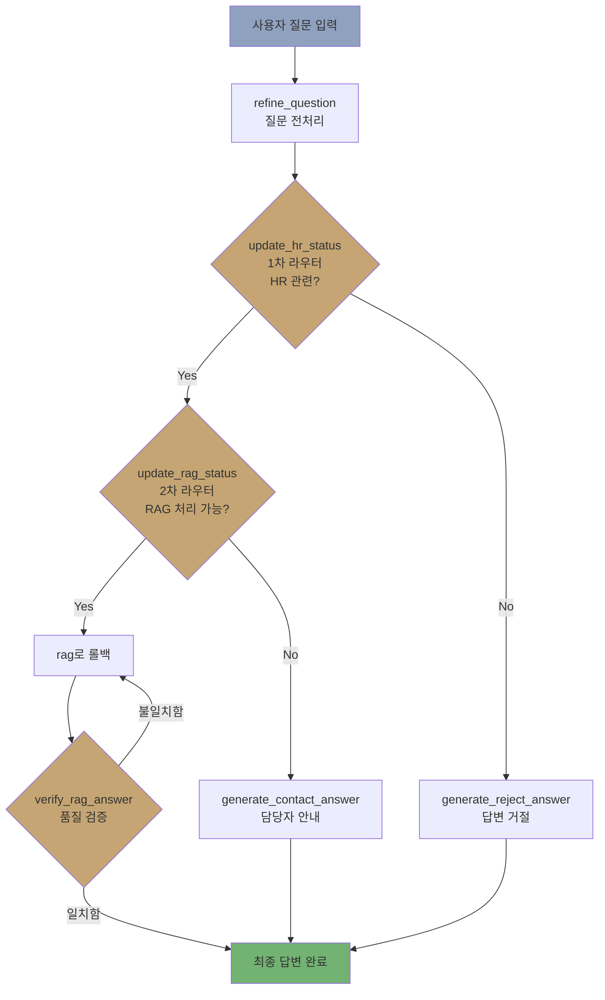

# 가이다 HR 챗봇 🤖

**RAG 기반 사내 HR 질문 응답 시스템**

가상의 회사 '가이다 플레이 스튜디오(Gaida Play Studio, GPS)'를 위한 AI 기반 HR 챗봇으로, RAG(Retrieval-Augmented Generation), Reranker, 검증 루프 기술을 사용하여 사내 정책에 대한 정확한 정보를 제공합니다.

> 🔗 **Live Demo**: [https://frontend-iqeh.onrender.com](https://frontend-iqeh.onrender.com)

## 📌 프로젝트 소개

이 프로젝트는 LangGraph 기반의 순환형 아키텍처를 구축하여 HR 관련 질문에 대해 정확하고 신뢰성 있는 답변을 제공하는 것을 목표로 합니다.

---

## 참여인원, 역할
4인, 1차 라우터, 거절 노드, 전처리 노드, 배포

---

## 🎯 핵심 기능

1.  **RAG 기반 정확한 답변 생성**: Pinecone 벡터 DB를 활용한 의미론적 문서 검색 및 신뢰성 있는 답변 생성
2.  **자동 질문 분류**: HR 관련 여부(1차) 및 RAG 처리 가능 여부(2차)를 자동으로 판단
3.  **AI 기반 답변 검증**: 답변 품질 검증 및 불일치 시 재생성 루프(Loop) 수행
4.  **담당 부서 안내 서비스**: RAG로 처리가 불가능한 질문에 대해 담당 부서(Email/Slack) 연결
5.  **사용자 친화적 질문 전처리**: 사용자 질문을 LLM이 이해하기 쉬운 형태로 자동 정제(Refine)

## 🗂 프로젝트 구조

```
📦 HR_chatbot_project/
├── 📂 backend/                 # FastAPI + LangGraph (API 키 보유)
│   ├── 📄 main.py              # FastAPI 엔트리포인트
│   ├── 📄 graph.py             # LangGraph 워크플로우 정의
│   ├── 📄 nodes.py             # 노드 구현 (검색, 생성, 검증)
│   ├── 📄 router.py            # 질문 분류 라우팅 로직
│   ├── 📄 state.py             # LangGraph State 정의
│   ├── 📄 db.py                # Pinecone 벡터 DB 연동
│   ├── 📄 llm.py               # LLM 팩토리 함수
│   ├── 📄 config.py            # 환경 변수 관리 (pydantic-settings)
│   ├── 📄 Dockerfile           # Backend Docker 이미지
│   └── 📄 requirements.txt     # Backend 의존성
├── 📂 frontend/                # Streamlit UI (API 키 미보유)
│   ├── 📄 app.py               # 챗봇 UI
│   ├── 📄 Dockerfile           # Frontend Docker 이미지
│   └── 📄 requirements.txt     # Frontend 의존성
├── 📄 docker-compose.yml       # Docker Compose 설정
├── 📄 render.yaml              # Render Blueprint 배포 설정
├── 📄 .env.example             # 환경 변수 템플릿
└── 📄 README.md
```

---

##

# [가이다 플레이 스튜디오] 사내 복지 정책 가이드 (v1.0)

본 문서는 가이다 플레이 스튜디오 구성원들의 일과 삶의 균형, 그리고 지속 가능한 성장을 지원하기 위한 복지 정책을 담고 있습니다.

---

## 1. 휴가 제도
직원들의 충분한 휴식과 재충전을 위해 다음과 같은 휴가 제도를 운영합니다.

* **연차 유급휴가**: 근로기준법에 의거하여 발생하며, 자유로운 연차 사용 문화를 지향합니다.
* **병가**: 질병 또는 부상으로 인해 직무 수행이 어려운 경우, 연간 일정 범위 내에서 유급/무급 병가를 지원합니다.
* **가족돌봄휴가**: 가족의 질병, 사고, 노령 및 자녀의 양육으로 인해 긴급하게 가족을 돌봐야 하는 경우 사용할 수 있습니다.

## 2. 경제적 지원 및 자기계발
직원의 성장이 곧 회사의 성장이라는 믿음으로 교육 및 활동비를 지원합니다.

* **복지포인트**: 매년 정해진 한도 내에서 개인의 기호에 맞게 사용할 수 있는 선택적 복지 포인트를 지급합니다.
* **교육비 지원**: 직무 관련 강의, 세미나, 도서 구입비 등 성장을 위한 비용을 적극 지원합니다.

## 3. 업무 환경 및 장비
최상의 퍼포먼스를 낼 수 있도록 업무 몰입 환경을 조성합니다.

* **업무 장비 지원**: 최신 사양의 PC/노트북(MacBook 등) 및 주변 기기를 제공하며, 교체 주기에 따른 업그레이드를 지원합니다.
* **스낵바 운영**: 사내 라운지에 다양한 간식과 음료, 커피를 상시 비치하여 자유롭게 이용할 수 있습니다.
* **동아리 활동 지원**: 구성원 간의 친목 도모와 취미 생활을 위해 사내 동아리 활동 운영비를 지원합니다.

## 4. 건강 관리
구성원의 건강한 삶을 최우선으로 생각합니다.

* **건강검진 지원**: 매년 또는 격년으로 전문 검진 기관을 통한 종합 건강검진 비용을 지원합니다.

## 5. 임신 및 육아 지원 (Womancare)
여성 직원이 일과 가정을 양립할 수 있도록 세심한 제도를 운영합니다.

* **임신 기간 단축 근로**: 임신 초기 및 후기 직원을 대상으로 근로 시간 단축을 시행합니다.
* **태아 검진 시간 보장**: 정기적인 태아 검진을 위해 필요한 시간을 유급으로 보장합니다.
* **육아기 근로시간 단축 및 휴직**: 법정 기준에 따른 육아휴직 및 육아기 단축 근로 제도를 적극 권장합니다.

*본 문서의 저작권은 '가이다 플레이 스튜디오'에 있으며, 외부 유출을 금합니다.*

---

## 🛠 기술 스택 (Tech Stack)

| 구분 | 기술 | 설명 |
|------|------|------|
| **Core Framework** | LangGraph | 복잡한 AI 워크플로우 및 상태 관리 |
| **Language** | Python 3.12 | 주 개발 언어 |
| **LLM** | GPT-4.1 / GPT-4.1-nano | 본문 생성 및 라우팅 판단 |
| **Vector DB** | Pinecone | 벡터 데이터베이스 (유사도 검색) |
| **Embedding** | text-embedding-3-small | 한국어 처리를 위한 효율적인 임베딩 모델 |
| **Frontend** | Streamlit | 챗봇 UI 구현 |
| **Backend** | FastAPI | API 서버 및 RAG 로직 처리 |
| **Deployment** | Docker, Render | 컨테이너 기반 배포 |
---

## 🔄 LangGraph 워크플로우



---

### 📋 각 노드 상세 설명

1. refine_question (전처리 노드)

기능: 사용자 질문을 LLM이 이해하기 쉬운 명확한 형태로 정제
입력: user_question
출력: refine_question
2. update_hr_status (1차 상태 업데이트)

기능: HR 관련 질문 여부 판단 결과를 State에 저장
LLM: GPT-4.1-nano (빠른 분류를 위한 경량 모델)
출력: is_hr_question (True/False)
3. route_after_hr (1차 라우터)

기능: is_hr_question 값에 따른 경로 분기
분기: HR 관련 → 2차 라우터 / 비관련 → 거절
4. update_rag_status (2차 상태 업데이트)

기능: RAG 처리 가능 여부 판단 결과를 State에 저장
LLM: GPT-4.1-nano (빠른 분류를 위한 경량 모델)
출력: is_rag_suitable (True/False)
5. route_after_rag (2차 라우터)

기능: is_rag_suitable 값에 따른 경로 분기
분기: RAG 가능 → 답변 생성 / 불가능 → 담당자 안내
6. generate_rag_answer (RAG 답변 생성)

기능: 벡터 검색 → 관련 문서 추출 → 답변 생성
프로세스:
Pinecone에서 Top-K 유사 문서 검색
GPT-4.1을 통한 답변 생성
출력: retrieved_docs, final_answer
7. verify_rag_answer (품질 검증)

기능: 생성된 답변이 검색 문서에만 근거했는지 검증
검증 기준: 문서 내용과의 완전한 일치 여부
출력: verification ("일치함"/"불일치함")
재처리: 불일치시 rag_answer로 루프백
8. generate_contact_answer (담당자 안내)

기능: RAG 처리 불가 질문에 대한 담당 부서 정보 제공
출력: 부서별 이메일, Slack 채널 정보
9. generate_reject_answer (질문 거절)

기능: HR 비관련 질문에 대한 정중한 거절 메시지
출력: "입력하신 질문은 HR 관련 문의가 아닙니다. HR 관련 질문만 가능합니다."

## 🚀 설치 및 실행 방법 (로컬 개발)

### 환경 변수 설정
프로젝트 루트에 `.env.example` 파일에 발급받은 API_KEY를 설정합니다.
```bash
OPENAI_API_KEY=your_openai_api_key
PINECONE_API_KEY=your_pinecone_api_key
PINECONE_INDEX=gaida-hr-rules
```

### 2. 실행 (Docker Compose 권장)
```bash
docker-compose up --build
```
- **Backend API**: http://localhost:8000
- **Frontend UI**: http://localhost:8501

---

## ☁️ Render 배포

Backend와 Frontend를 **각각 별도 Web Service**로 배포합니다.

### 서비스 구성

| 서비스 | URL | 역할 |
|---|---|---|
| Backend | `https://hr-chatbot-project.onrender.com` | FastAPI + RAG API |
| Frontend | `https://frontend-iqeh.onrender.com` | Streamlit 챗봇 UI |

### Step 1: Backend 서비스

| 설정 | 값 |
|---|---|
| Runtime | Docker |
| Dockerfile Path | `./backend/Dockerfile` |
| Docker Build Context | `.` |
| Health Check Path | `/health` |

**Environment Variables:**
| Key | Value |
|---|---|
| `OPENAI_API_KEY` | `sk-...` |
| `PINECONE_API_KEY` | `pcsk_...` |
| `PINECONE_INDEX` | `gaida-hr-rules` |
| `ALLOWED_ORIGINS` | `https://frontend-iqeh.onrender.com` |

### Step 2: Frontend 서비스

| 설정 | 값 |
|---|---|
| Runtime | Docker |
| Dockerfile Path | `./frontend/Dockerfile` |
| Docker Build Context | `.` |

**Environment Variables:**
| Key | Value |
|---|---|
| `BACKEND_URL` | `https://hr-chatbot-project.onrender.com` |

### API 엔드포인트

| Method | Path | 설명 |
|---|---|---|
| `GET` | `/` | 서버 상태 확인 |
| `GET` | `/health` | Health Check |
| `GET` | `/docs` | Swagger API 문서 |
| `POST` | `/chat` | 챗봇 질의 (`{"query": "질문"}`) |

---

## 📝 사용 예시

**✅ RAG 답변**
```
👤: "입사 4개월차에는 연차 얼마나 있나요?"
🤖: "입사 4개월 차라면 1년 미만 근속자에 해당하므로, 매달 1개월 만근 시 1개의 월차가 부여됩니다..."
```

**📞 담당자 안내**
```
👤: "급여 계산에 오류가 있는 것 같은데 어디에 문의해야 하나요?"
🤖: "해당 문의사항은 인사팀으로 문의하시면 됩니다. 📧 hr@gaida.play.com 💬 #ask-hr"
```

**❌ 질문 거절**
```
👤: "오늘 날씨가 어때요?"
🤖: "입력하신 질문은 HR 관련 문의가 아닙니다. HR 관련 질문만 가능합니다."
```

---

## 👥 개발 과정

| 내용 |
|---|---|
| 요구사항 분석 및 아키텍처 설계 |
| 가상 회사 데이터 제작 및 벡터DB 구축 |
| LangGraph 노드 개발 및 라우팅 로직 구현 |
| 통합 테스트 및 LangGraph Studio 최적화 |
| MVP 완성 및 시연 준비 |
| 배포 |

### 주요 성과
- **답변 정확성 향상**: 검색, 리랭킹, 답변 검증 루프를 통해 답변 에러 확률을 2%에서 0%로 축소했습니다.
- **응답 속도 개선**: 프롬프트 최적화 및 경량 모델(GPT-4o-mini) 도입으로 First Token Latency(P50)를 0.59s로 단축했습니다.
- **안정성 확보**: 전처리 로직 강화를 통해 보안 위배 질문 차단 및 프롬프트 충돌 방지 구조를 확립했습니다.
- LangGraph 기반 순환형 아키텍처 구축 경험(조건부 분기 및 예외 처리 로직 설계)
- 리랭킹과 답변 검증 루프가 적용된 RAG 시스템을 구축하여, 환각을 최소화하고 답변 정확도 향상 기술 경험

## 문제해결

- RAG 파이프라인 고도화: 검색, 리랭킹, 답변 정확성 검증 루프 구현을 통한 답변 에러 확률 축소 2% → 0%
- 응답 속도 8% 개선: 프롬프트 최적화 및 경량 모델(GPT-4o-mini) 도입을 통해 First Token Latency(P50)를 0.64s → 0.59s로 단축
- 프롬프트 내 지시 사항의 우선순위를 재정립하여 충돌을 방지, 보안 위배 질문이 RAG로 넘어가지 않도록 전처리 로직 강화하여 답변 안정성, 평균 답변 시작 시간을 0.6~1.6s 확보
- 코드 복잡도 해소: 복잡한 파싱 로직을 Structured Output(구조화된 출력) 방식으로 리팩토링하여 오버엔지니어링 문제를 해결하고 유지보수성 향상

### 주요 도전과제

| 과제 | 문제 | 해결 |
|---|---|---|
| HR 데이터 확보 | 기밀성·저작권으로 실제 데이터 사용 불가 | 가상 회사 모델링으로 데이터셋 자체 제작 |
| 임베딩 모델 메모리 | 한국어 특화 모델 메모리 부족 | OpenAI embeddings-3-small API 활용 |
| 답변 품질 일관성 | RAG 답변 정확성 보장 필요 | 문서 기반 검증 + 재생성 루프 구현 |
| 코드 복잡도 | 오버엔지니어링 발생 | `with_structured_output`으로 단순화 |

---